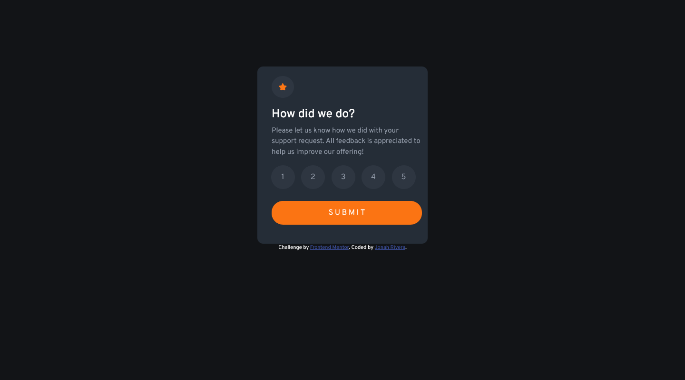
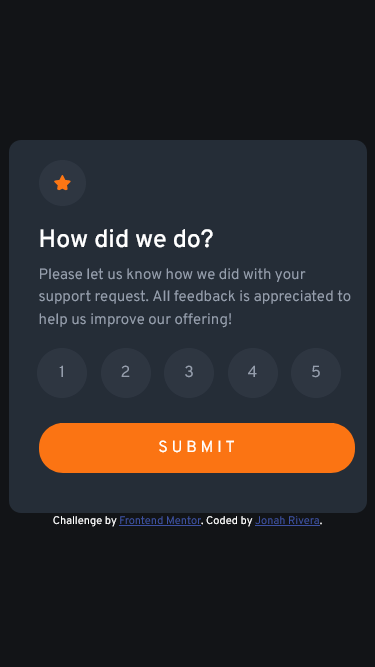
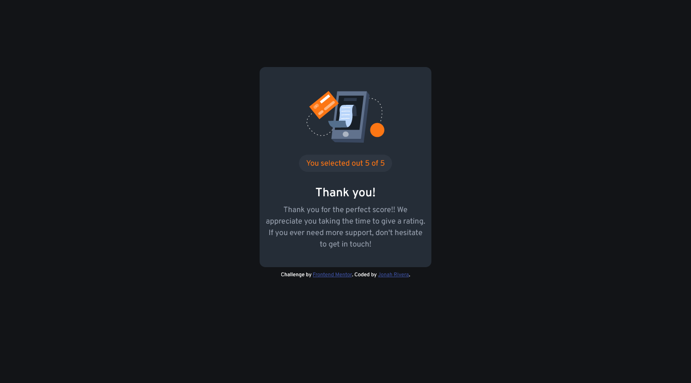

# Frontend Mentor - Interactive rating component solution

This is a solution to the [Interactive rating component challenge on Frontend Mentor](https://www.frontendmentor.io/challenges/interactive-rating-component-koxpeBUmI). Frontend Mentor challenges help you improve your coding skills by building realistic projects.

## Table of contents

- [Overview](#overview)
  - [The challenge](#the-challenge)
  - [Screenshot](#screenshot)
  - [Links](#links)
- [My process](#my-process)
  - [Built with](#built-with)
  - [What I learned](#what-i-learned)
  - [Continued development](#continued-development)
  - [Useful resources](#useful-resources)
- [Author](#author)
- [Acknowledgments](#acknowledgments)

## Overview

### The challenge

Users should be able to:

- View the optimal layout for the app depending on their device's screen size
- See hover states for all interactive elements on the page
- Select and submit a number rating
- See the "Thank you" card state after submitting a rating

### Screenshot






### Links

- Solution URL: [Interactive Rating Solution](https://www.frontendmentor.io/solutions/interactive-rating-using-bootstrap-YRx91tpBQL)
- Live Site URL: [Interactive Rating Page](https://bobfisherman18.github.io/interactive-rating-component/)

## My process

### Built with

- Semantic HTML5 markup
- CSS custom properties
- Flexbox
- CSS Grid
- Mobile-first workflow
- [Bootstrap](https://getbootstrap.com/) - Bootstrap

### What I learned

I learned to implement Javascript for the first time in this project. Biggest challenge is to show
the output of user data in the Thank you webpage I've created. I've used a local storage method to store data by using name/value pairing.
I've put a internal script tag in my Thank You webpage and used the getItem method.

```js
localStorage.setItem("rating", "1");

document.getElementById("rating").innerHTML = localStorage.getItem("rating");
```

### Continued development

I will continue to improve my Javascript skills because I want to know a more shorter, simpler, and readable way to use Javascript.

### Useful resources

- [W3Schools](https://www.w3schools.com/) - This what helped me learn HTML and CSS.
- [Youtube](https://www.youtube.com/@BroCodez) - This Youtuber also helped me learn HTML and CSS. In addition, I watched a lot of Youtube videos about HTML and CSS. Youtube is your best friend in learning web development!
- [Bootstrap](https://getbootstrap.com/) Always read the documentation!
- [Stackoverflow](https://stackoverflow.com/questions/14873074/get-the-id-of-the-image-from-another-html-file-using-javascript) This forum helped me understand what local storage is.

## Author

- Website - [Jonah Rivera](https://github.com/BobFisherman18)
- Frontend Mentor - [@BobFisherman18](https://www.frontendmentor.io/profile/BobFisherman18)

## Acknowledgments

I would like to thank Frontend Mentor for giving me the opportunity to practice my front-end development!
